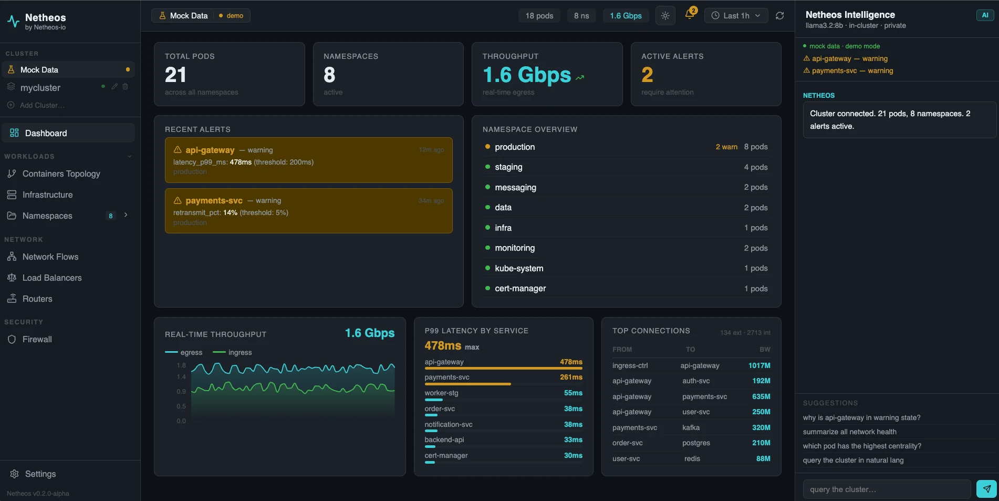
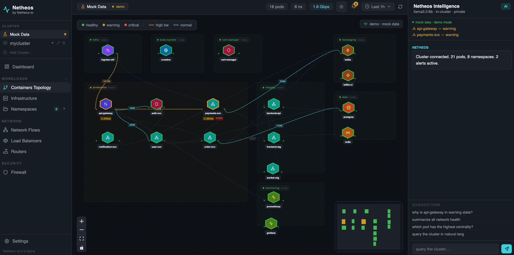
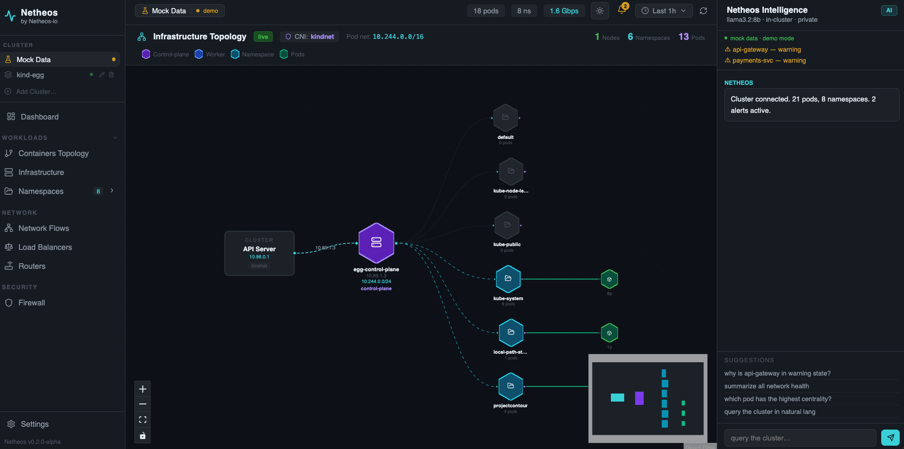
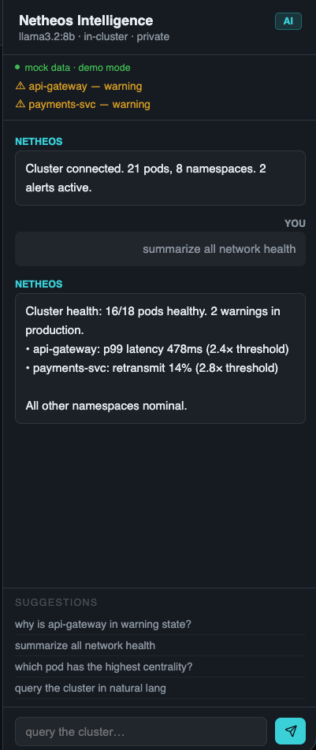
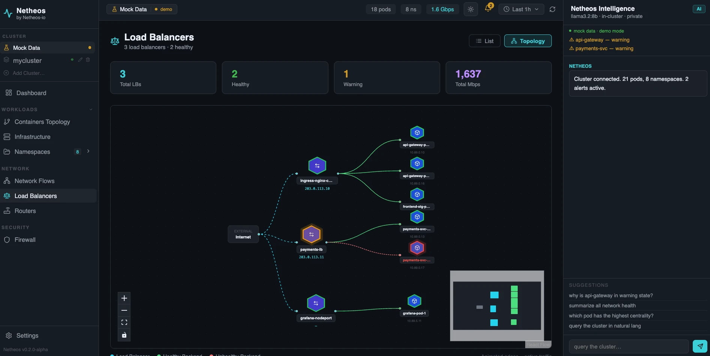
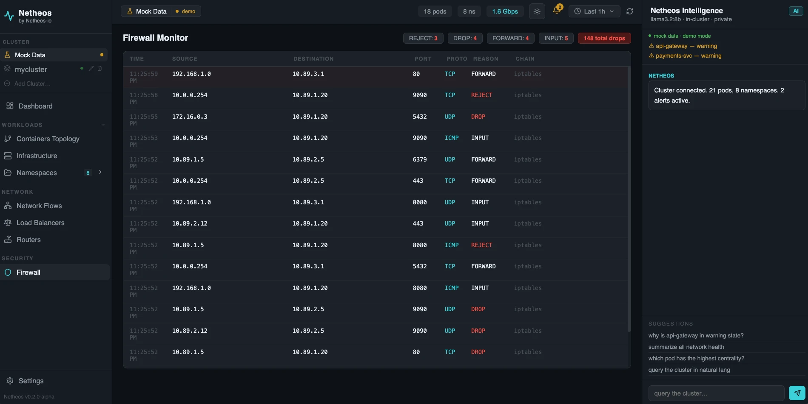

<p align="center">
  
</p>

# Netheos

**Real-time Kubernetes observability with eBPF network capture, interactive topology UI, and an embedded AI Assistant — running entirely inside your cluster.**

[](https://operatorhub.io/operator/netheos)
[](https://artifacthub.io/packages/helm/netheos/netheos)
[](LICENSE)
[](https://kubernetes.io)

---

## Screenshots

| Dashboard | Container Topology |
|---|---|
|  |  |

| Infrastructure Topology | AI Assistant |
|---|---|
|  |  |

| Load Balancers | Firewall |
|---|---|
|  |  |

---

## Features

- **eBPF-based capture** — Zero-instrumentation packet capture at kernel level, no code changes required
- **In-cluster AI Assistant** — Llama 3.2 8B via Ollama, or plug in OpenAI / Anthropic / Azure
- **Interactive topology** — Live namespace/pod/service graph with animated flow edges
- **Infrastructure view** — K8s nodes, CNI plugin, pod CIDRs, cross-namespace flows
- **Firewall monitoring** — iptables/nftables drops captured in real time
- **Alert rules** — `NetheosAlert` CRD for metric threshold rules with webhook support
- **Scheduled insights** — `NetheosInsight` CRD for cron-based AI queries
- **Multi-cluster federation** — Federate multiple clusters into a single dashboard
- **Prometheus integration** — ServiceMonitor included out of the box
- **Privacy first** — All data and AI inference run entirely inside your cluster

---

## Quick Start (Helm)

```bash
helm repo add netheos https://rauldsl.github.io/netheos
helm repo update
helm install netheos netheos/netheos -n netheos-system --create-namespace
```

Access the UI:

```bash
kubectl port-forward -n netheos-system svc/netheos-webui 8080:8080
# → http://localhost:8080
```

**Custom values** (AI provider, service type, etc.):

```bash
helm install netheos netheos/netheos \
  -n netheos-system --create-namespace \
  --set netheos.aiAssistant.provider=openai \
  --set netheos.aiAssistant.model=gpt-4o \
  --set netheos.aiAssistant.apiKeySecret.name=openai-credentials \
  --set netheos.aiAssistant.apiKeySecret.key=api-key \
  --set netheos.webUI.serviceType=LoadBalancer
```

---

## Quick Start (OLM / OperatorHub)

```bash
# 1. Install via OLM subscription
kubectl apply -f https://raw.githubusercontent.com/rauldsl/netheos/main/deploy/olm/subscription.yaml

# 2. Deploy the full stack with one CR
kubectl apply -f - <<EOF
apiVersion: netheos.netheos-io.io/v1alpha1
kind: NetheosConfig
metadata:
  name: cluster
spec:
  aiAssistant:
    provider: ollama
    model: "llama3.2:8b"
  webUI:
    serviceType: ClusterIP
EOF

# 3. Wait for all pods
kubectl get pods -n netheos-system -w

# 4. Open the UI
kubectl port-forward -n netheos-system svc/netheos-webui 8080:8080
# → http://localhost:8080
```

---

## Quick Start (local kind cluster)

```bash
git clone https://github.com/rauldsl/netheos.git
cd netheos

# Full deploy: build → load into kind → deploy
./hack/dev.sh up

# Access the UI
make port-forward
# → http://localhost:8080
```

---

## CRDs

| CRD | Scope | Description |
|-----|-------|-------------|
| `NetheosConfig` | Cluster | Top-level CR — installs the full Netheos stack |
| `NetheosAlert` | Namespace | Metric threshold alert rule |
| `NetheosInsight` | Namespace | Scheduled natural-language AI query |
| `NetheosService` | Namespace | Service-level observability and custom thresholds |

### NetheosConfig example

```yaml
apiVersion: netheos.netheos-io.io/v1alpha1
kind: NetheosConfig
metadata:
  name: cluster
spec:
  namespace: netheos-system
  aiAssistant:
    provider: ollama          # ollama | openai | anthropic | azure | none
    model: "llama3.2:8b"
    gpuEnabled: false
  agent:
    sampleRate: 1
    dnsTracking: true
    firewallTracking: true
  aggregator:
    replicas: 1
    retentionWindow: "1h"
  webUI:
    serviceType: ClusterIP    # ClusterIP | NodePort | LoadBalancer
  audit: true
```

### NetheosAlert example

```yaml
apiVersion: netheos.netheos-io.io/v1alpha1
kind: NetheosAlert
metadata:
  name: high-latency
  namespace: netheos-system
spec:
  metric: latency_p99_ms
  operator: Gt
  threshold: 200
  for: "2m"
  severity: warning
```

---

## Architecture

```
Browser
  │  SSE /ws  →  netheos-webui (nginx:8080)
  │               └─ proxy → netheos-aggregator:9091
  │  AI chat  →  netheos-aggregator /api/llm → Ollama / OpenAI
  │
netheos-aggregator (Deployment)
  │  ClusterSnapshot every 800ms from K8s API + eBPF flows
  │  Exposes /metrics for Prometheus
  │
netheos-agent (DaemonSet — every node)
  │  eBPF probes: L3/L4 flows, DNS, firewall drops
  └─ gRPC → netheos-aggregator:9090
  │
netheos-operator (Deployment)
  └─ Reconciles NetheosConfig → deploys all of the above
```

See [docs/architecture.md](docs/architecture.md) for full detail.

---

## AI Assistant configuration

```yaml
# Bundled Ollama (default)
aiAssistant:
  provider: ollama
  model: "llama3.2:8b"

# OpenAI
aiAssistant:
  provider: openai
  model: gpt-4o
  apiKeySecret:
    name: openai-credentials
    key: api-key

# Anthropic
aiAssistant:
  provider: anthropic
  model: claude-sonnet-4-6
  apiKeySecret:
    name: anthropic-credentials
    key: api-key

# Disable AI
aiAssistant:
  provider: none
```

---

## Requirements

| Component | Minimum |
|-----------|---------|
| Kubernetes | 1.27+ |
| OLM | 0.28+ |
| CPU (operator) | 100m |
| Memory (operator) | 128Mi |
| CPU (Ollama, optional) | 2 cores |
| Memory (Ollama, optional) | 8Gi |

---

## Images

| Image | Registry |
|-------|----------|
| Operator | `ghcr.io/rauldsl/netheos-operator:v0.1.0` |
| Aggregator | `ghcr.io/rauldsl/netheos-aggregator:v0.1.0` |
| Agent | `ghcr.io/rauldsl/netheos-agent:v0.1.0` |
| WebUI | `ghcr.io/rauldsl/netheos-webui:v0.1.0` |

---

## Contributing

See [CONTRIBUTING.md](CONTRIBUTING.md). All contributions welcome — open an issue or PR.

---

## License

Apache 2.0 — see [LICENSE](LICENSE).
